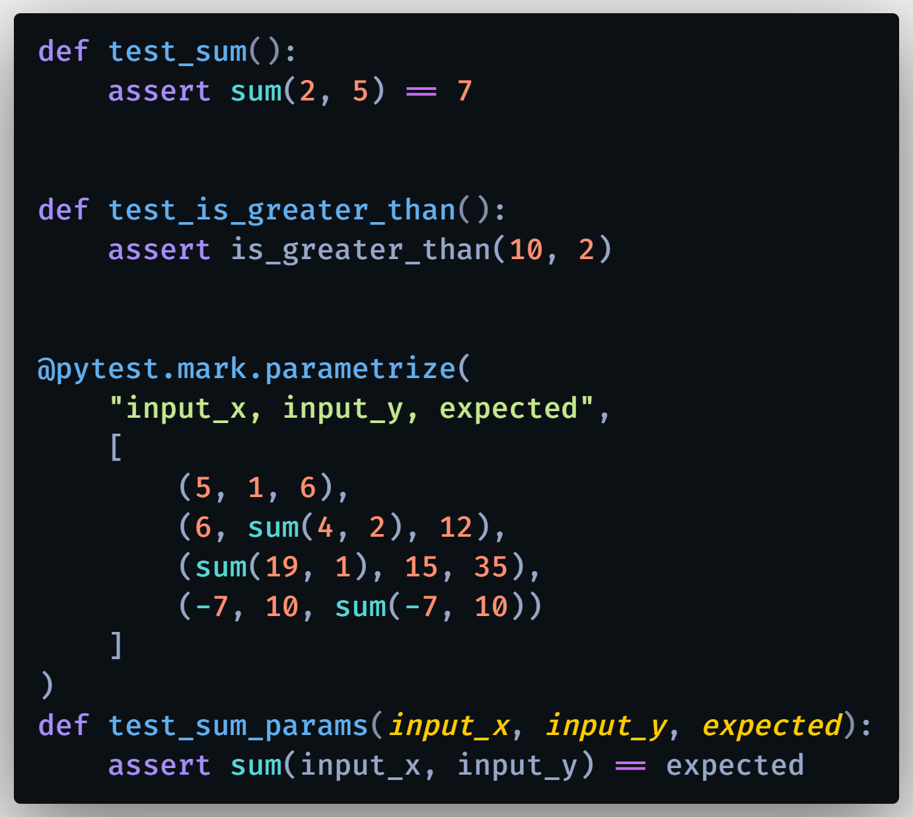
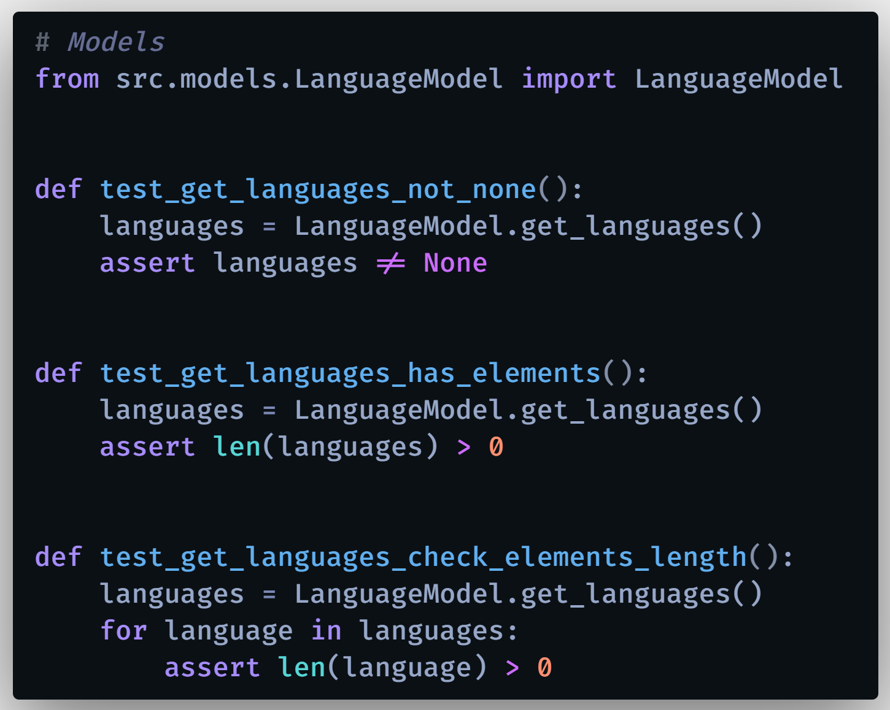

# PyTest: Pruebas Unitarias (Unit Tests) en Python 

Aprende a probar (testear) tu código Python usando la librería PyTest. Las pruebas unitarias (Unit Tests) son muy importantes al desarrollar cualquier proyecto, conoce cómo verificar tu código de forma automatizada usando el paquete 'PyTest' de Python, realizando pruebas de control de calidad.

¿Por qué es importante probar nuestro código? Porque debemos asegurar que todas las funcionalidades de nuestras aplicaciones sigan funcionando correctamente a pesar de realizar cambios, mejoras o actualizaciones del código fuente.

Primero, crear un entorno virtual:
### `python -m virtualenv env`

Para instalar los paquetes necesarios:
### `pip install -r requirements.txt`

 

Documentación de PyTest: https://docs.pytest.org/en/latest/

  

